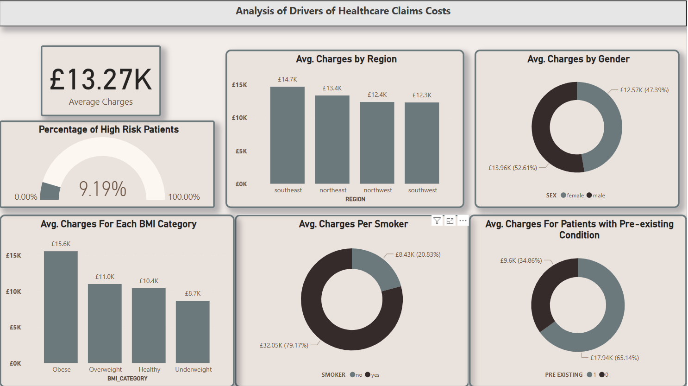
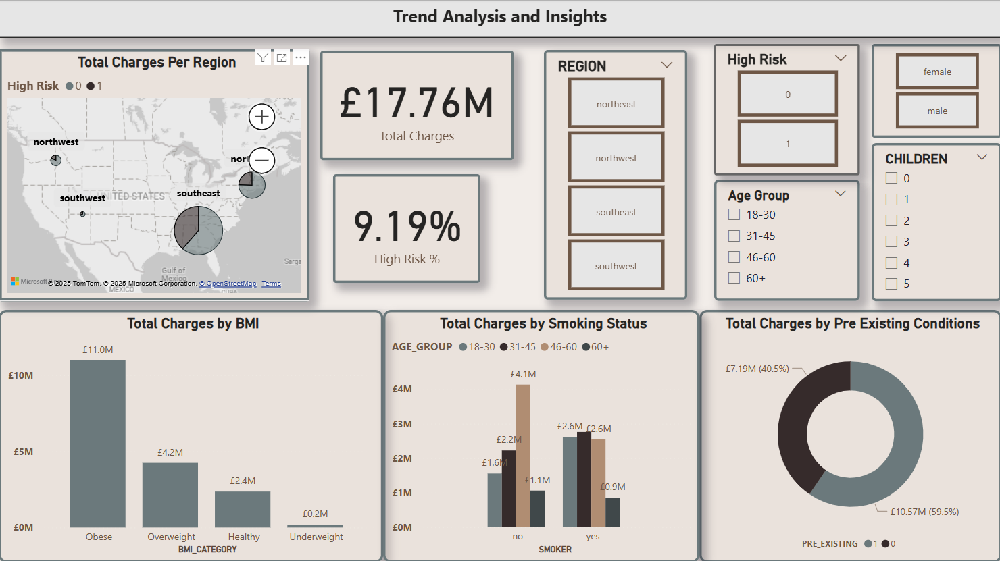
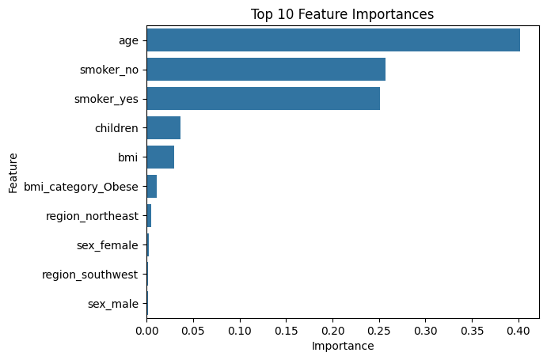

# Health-Insurance-Claims-Cost-Analysis
This project analyzes medical insurance claim costs using machine learning to predict expenses, profile high-risk claimants, and identify key cost drivers. The insights are visualized in an interactive Power BI dashboard for business intelligence. Designed for insurers, actuaries, and healthcare analysts.

## Key Features  
- 🧠 **Predictive Modeling**: 5 regression models (Linear, Ridge, Lasso, Random Forest, Gradient Boosting) to forecast claim costs  
- 📊 **Power BI Dashboard**: Interactive visualizations of high-risk profiles and cost drivers
- 🔍 **High-Risk Profiling**: Identifies claimants with top 20% expenses using synthetic pre-existing conditions  
- ⚙️ **Feature Engineering**:  
  - BMI categories (Underweight/Healthy/Overweight/Obese)  
  - Age groups (18-30, 31-45, 46-60, 60+)  
  - High-risk flag (smoker + BMI ≥30 + pre-existing condition)  

## Power BI Dashboard Insights
# Claims Cost Analysis

---

**Key Visualizations:**
1. High-Risk Claimant Distribution by Region
2. Cost Breakdown by Age Group and BMI Category
3. Smoker vs Non-Smoker Cost Comparison
4. Pre-existing Condition Impact Analysis
5. Top 5 Cost Driver Indicators
 ---
# Analysis of Key Drivers with Filters for Different Regions

**Interactive Features:**
- Drill-down regional analysis
- Dynamic risk profiling filters
- Year-over-year cost trend projections
- Claimant demographic segmentation

**Power BI Analysis Findings:**
- Smokers incur 3.8x higher costs than non-smokers
- Obese claimants represent 68% of high-cost cases
- Southwest region has 22% more high-risk claimants
- 60+ age group accounts for 41% of top-cost claims
---
## Results  
| Model                  | R² Score | 
|------------------------|----------|
| Gradient Boosting      | 0.88     | 
| Random Forest          | 0.87     |  
| Ridge Regression       | 0.85     |  

---

# Importance of Top 10 Features

---

## Dataset  
`insurance.csv` with columns:  
- `age`, `sex`, `bmi`, `children`, `smoker`, `region`, `charges`  
- **Engineered Features**: `pre_existing_condition`, `bmi_category`, `age_group`, `high_risk`  
